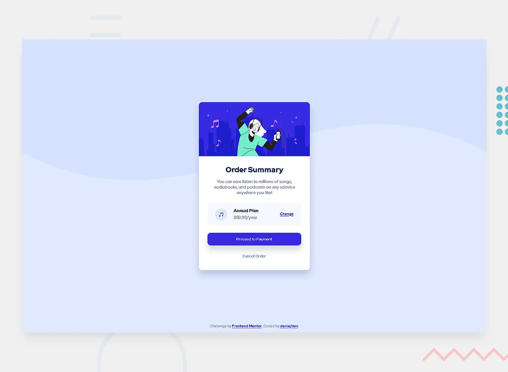

# Order summary card solution - Frontend Mentor

This is a solution to the [Order summary card challenge on Frontend Mentor](https://www.frontendmentor.io/challenges/order-summary-component-QlPmajDUj).

## Table of contents

- [Overview](#overview)
  - [The challenge](#the-challenge)
  - [Screenshot](#screenshot)
  - [Links](#links)
- [Built with](#built-with)
- [Author](#author)

## Overview

### The challenge

Users should be able to:
- See hover states for interactive elements

### Screenshot

### Links

- Solution URL: [github](https://github.com/denielden/sass-order-summary-card)
- Live Site URL: [live site](https://denielden.github.io/sass-order-summary-card)

## Built with

- Semantic HTML5 markup
- CSS custom properties
- Flexbox
- Mobile-first workflow
- [Sass](https://sass-lang.com/)

## Author

- Website - [denielden](https://denielden.github.io)
- Frontend Mentor - [@denielden](https://www.frontendmentor.io/profile/denielden)

## **Have fun building!** 🚀